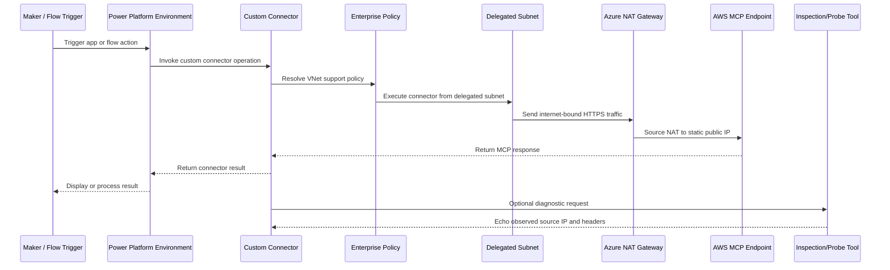
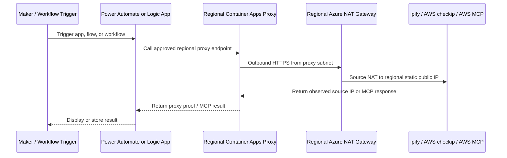
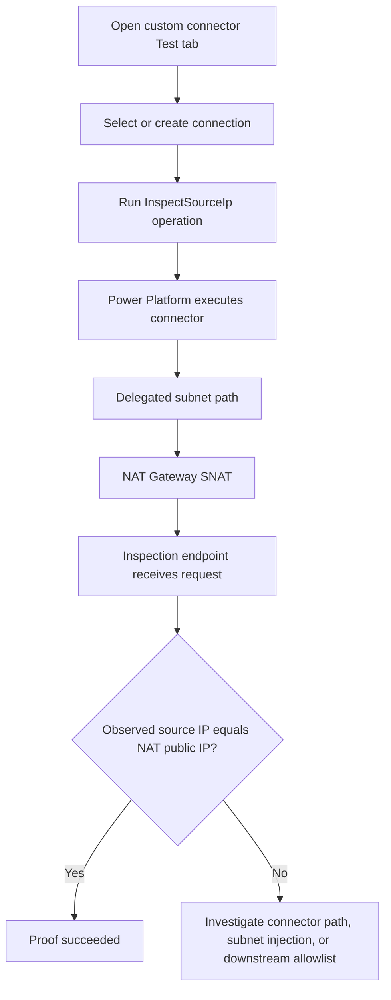

# Application Flow

## Runtime Flow



## Regional Proxy Flow



The proxy flow is the enforceable AWS-facing pattern. Power Automate and Logic Apps do not call AWS or public echo services directly; they call the regional proxy, and the proxy owns outbound egress.

## Proof Flow



## Failure Signals

| Symptom | Likely cause | What to check |
| --- | --- | --- |
| 503 with `Container allocated` | Power Platform delegated connector container is warming up | Wait for the `retry-after` value and retry |
| No request in destination logs | Connector did not reach the endpoint | Check connector URL, connection, DLP policy, and Power Platform test response |
| Destination sees Power Automate service IP | Wrong workload path | Use VNet-supported custom connector or Dataverse plug-in instead of built-in HTTP |
| AWS returns 403 | AWS allowlist/auth blocked the call | Check AWS WAF/IP set/security group/API Gateway resource policy and connector authentication |
| AWS timeout | Network path or endpoint unreachable | Confirm public DNS, TLS certificate, route, listener, and inbound 443 rules |
| Proxy proof returns non-NAT IP | Proxy subnet or NAT association is wrong | Check Container Apps environment subnet delegation and NAT Gateway association |
| Direct flow still reaches AWS | Bypass path is still allowed | Block direct HTTP/unapproved connectors and enforce AWS allowlist for proxy NAT IPs only |

## Confirmed Demo Flow

```text
NAT Proof Inspector custom connector
  -> Power Platform environment <power-platform-environment-id>
  -> North Europe delegated connector runtime
  -> NAT Gateway public IP <north-region-nat-ip>
  -> France Central inspection endpoint
```

```text
North Europe Logic App example
  -> North Europe Container Apps proxy
  -> NAT Gateway public IP <north-region-nat-ip>
  -> api.ipify.org and checkip.amazonaws.com
```

```text
West Europe Logic App example
  -> West Europe Container Apps proxy
  -> NAT Gateway public IP <west-region-nat-ip>
  -> api.ipify.org and checkip.amazonaws.com
```