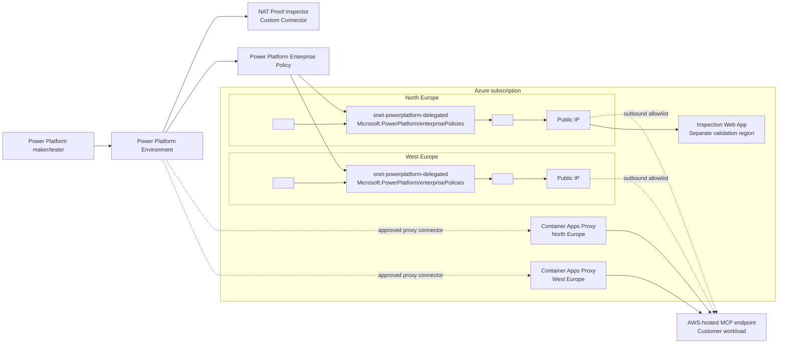

# Architecture Design

## Logical Architecture



## Key Design Choices

| Decision | Reason |
| --- | --- |
| Two delegated subnets | Power Platform Europe maps to paired Azure regions. The enterprise policy references both subnets. |
| NAT Gateway per delegated subnet | Keeps egress deterministic for either regional runtime path. |
| Standard static public IPs | Provides stable IPs that downstream services, including AWS, can allowlist. |
| External inspection endpoint | Proves the source IP from the destination side rather than relying on Azure configuration alone. |
| Custom connector proof path | VNet-supported connector execution is the relevant path; built-in HTTP actions are ambiguous. |
| Customer-controlled proxy path | Provides an enforceable AWS-facing egress point for Power Platform and Logic Apps integrations. |

## Proven Path

The current proven call executed from the North Europe Power Platform runtime path:

```text
Power Platform custom connector
  -> North Europe delegated subnet
  -> <north-region-nat-gateway-name>
  -> <north-region-nat-ip>
  -> France Central inspection endpoint
```

The destination observed `<north-region-nat-ip>` and the request included `x-ms-subnet-delegation-enabled: true`.

## Validated Regional Proxy Path

The customer-controlled proxy pattern is proven in both regional VNets:

```text
Power Platform or Logic App
    -> regional proxy endpoint
    -> Container Apps subnet in regional VNet
    -> regional NAT Gateway public IP
    -> api.ipify.org / checkip.amazonaws.com / AWS MCP
```

| Region | Proxy endpoint | Destination-observed IP |
| --- | --- | --- |
| North Europe | `https://<north-region-proxy-host>` | `<north-region-nat-ip>` |
| West Europe | `https://<west-region-proxy-host>` | `<west-region-nat-ip>` |