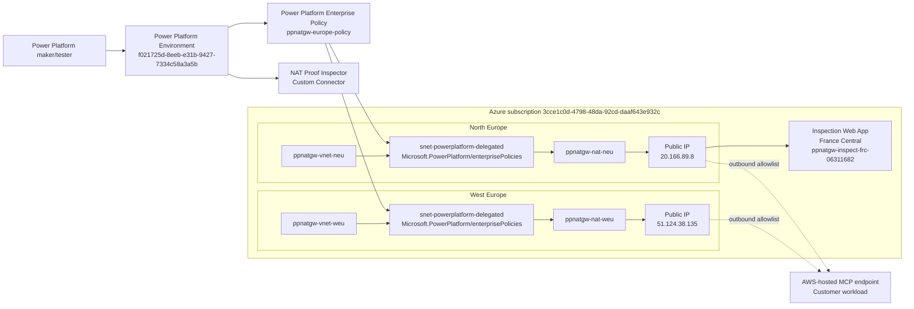

# Architecture Design

## Logical Architecture



## Key Design Choices

| Decision | Reason |
| --- | --- |
| Two delegated subnets | Power Platform Europe maps to paired Azure regions. The enterprise policy references both subnets. |
| NAT Gateway per delegated subnet | Keeps egress deterministic for either regional runtime path. |
| Standard static public IPs | Provides stable IPs that downstream services, including AWS, can allowlist. |
| External inspection endpoint | Proves the source IP from the destination side rather than relying on Azure configuration alone. |
| Custom connector proof path | VNet-supported connector execution is the relevant path; built-in HTTP actions are ambiguous. |

## Proven Path

The current proven call executed from the North Europe Power Platform runtime path:

```text
Power Platform custom connector
  -> North Europe delegated subnet
  -> ppnatgw-nat-neu
  -> 20.166.89.8
  -> France Central inspection endpoint
```

The destination observed `20.166.89.8` and the request included `x-ms-subnet-delegation-enabled: true`.

## Pending Path

The West Europe NAT Gateway is deployed and bound by the enterprise policy, but it has not yet been observed by the destination endpoint:

```text
Expected West Europe destination-observed IP: 51.124.38.135
```

That proof requires a Power Platform execution path that runs from the West Europe paired runtime.